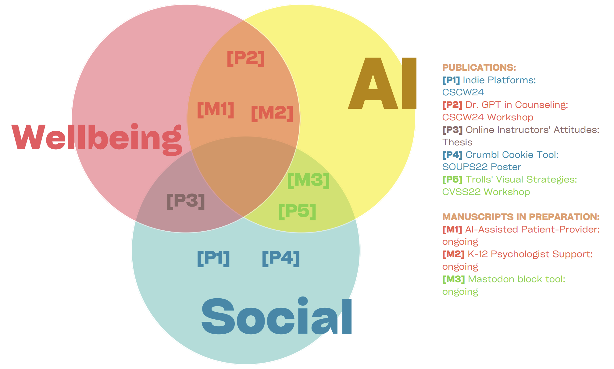

<!-- 
  You can also find my articles on <u><a href="{{author.googlescholar}}">my Google Scholar profile</a>.</u>





  
 -->

<!-- Google tag (gtag.js) -->

## Publications
- **[P1]** Yuhan Liu, **Owen Xingjian Zhang**, Mariana Consuelo Fernandez, Vibhav Nanda, Ankhitha Manjunatha, Alexander Yang, Orestis Papakyriakopoulos, Andrés Monroy-Hernández. (2024). [“Mapping out the Ecosystem of Independent Food Delivery Platforms.”](https://arxiv.org/abs/2402.14159) *CSCW 2024 Full paper*.

- **[P2]** **Owen Xingjian Zhang**, Shuyao Zhou, Jiayi Geng, Yuhan Liu, Sunny Xun Liu. [“Dr. GPT in Campus Counseling: Understanding Higher Education Students' Opinions on LLM-assisted Mental Health Services.”](https://arxiv.org/pdf/2409.17572) *CSCW 2024 Workshop*.

- **[P3]** **Owen Xingjian Zhang**, Tiffany Li, Karrie Karahalios. (2023). "The Change of Attitudes and Perceived Effectiveness in First-Time Online Instructors During COVID-19." Senior Thesis, UIUC.

- **[P4]** Yi-Shyuan Chiang, Ho Shan Lam, **Owen Xingjian Zhang**, Eshwar Chandrasekharan. (2022). [“Crumbl: An Awareness-Enhancing Tool for Cookie Collection.”](https://www.usenix.org/system/files/soups2022-poster53_chiang_abstract_final.pdf) *SOUPS 2022 Poster*.

- **[P5]** Maggie Zhang, **Owen Xingjian Zhang**, Ruisong Li. (2022). "Pictures Tell a Thousand Words: Using Computer Vision to Explore Trolls' Visual Strategies." *CVSS 2022 Workshop*.

## Manuscripts in Preparation
- **[M1]** **Owen Xingjian Zhang**, Sunny Xun Liu, Ilana Shumsky, Jeffery Hancock. "Exploring AI-Assisted Patient-Provider Dynamics: A Comparative Study of AI Roles and Support Types in Digital Health." To be submitted to *CHI 2026*.

- **[M2]** Allen Song, **Owen Xingjian Zhang**, Elizebeth Murnane. "Design Technologies that Support School Psychologists in K-12 Education." To be submitted to *CSCW 2025*.

- **[M3]** **Owen Xingjian Zhang**, Andrés Monroy-Hernández. "Enhancing Moderation in Decentralized Social Media: A Comprehensive Approach to Blocklist Management and Customization on Mastodon." To be submitted to *UIST 2025*.

